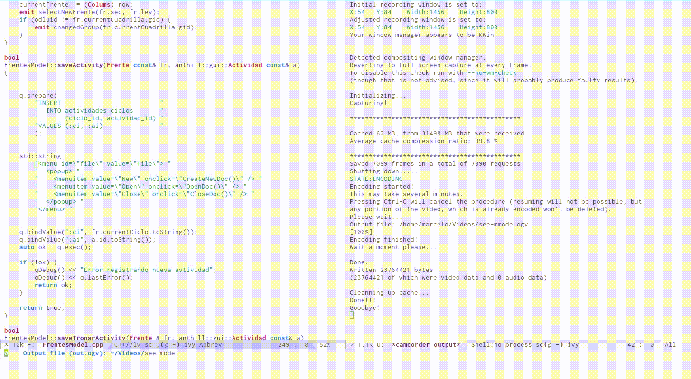

# see minor mode

Edit string in  a separate buffer with appropriate  major mode enabled
in it.  Currently only support python, c++ and c mode.

This plugin  use `language-detection`  package to infer which major
mode should use.

This is a work in progress, pull request are welcome!.

## How to use

Use  `see-edit-src-at-point` to  edit  a literal  string (SQL  content
meantime).  You  can use `C-x s`  to update  content back, `C-c '`  to
save and exit  from see minor mode  and `C-c C-k` to  exit and discard
any modification saved or not.

## `see` it in action

